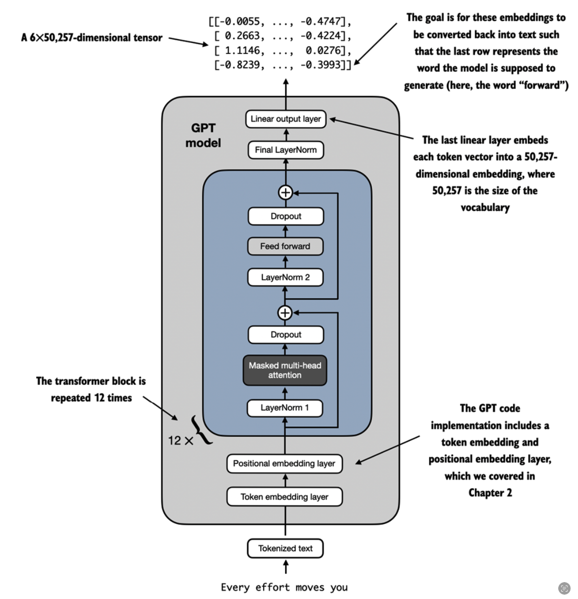
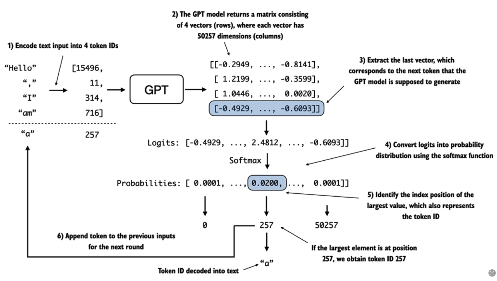

# LLM Do it yourself 

# Large Language Model (LLM) Implementation

This project is an implementation of a Large Language Model (LLM) based on the book 
"Build a Large Language Model (From Scratch)" by Pete Thorasak. The goal is to create a GPT-like language model from 
scratch using Python and PyTorch.

## Overview

The process of building the LLM involves several steps:

1. Data collection and preparation
2. Tokenization and vocabulary creation
3. Implementing the model architecture (Transformer)
4. Training the model on the collected data
5. Using the trained model for text generation
6. Hyperparameter optimization for quality improvement

The general architecture of the GPT model is shown in the following image:



## Implementation Details

### Data Preparation

The first step is to collect and prepare a large corpus of text data for training the model. This can include various 
sources such as books, articles, websites, etc. The data is cleaned, preprocessed, and formatted into a suitable format 
for training.

### Tokenization and Vocabulary

The text data is tokenized into individual words or subwords, and a vocabulary is created based on the most frequent 
tokens. This vocabulary is used to convert the text into numerical representations that can be fed into the model.

### Model Architecture

The LLM architecture is based on the Transformer model, which consists of several key components:

- **Self-Attention Mechanism:** Allows the model to attend to different parts of the input sequence and capture dependencies between tokens.
- **Positional Encoding:** Adds positional information to the input tokens to capture the order and position of each token in the sequence.
- **Masked Language Modeling:** A training objective where the model learns to predict masked tokens based on the surrounding context.

The model is implemented using the PyTorch library, following the architecture described in the book.

### Training

The prepared data is used to train the LLM. The training process involves feeding batches of input sequences into the 
model, computing the loss based on the masked language modeling objective, and updating the model parameters using 
backpropagation and an optimizer.

### Text Generation

Once the model is trained, it can be used for text generation. Given a prompt or a starting sequence, the model 
generates subsequent tokens based on the learned patterns and dependencies. The process of text generation using the 
GPT model is illustrated in the following image:



### Hyperparameter Optimization

To improve the quality of the generated text, various hyperparameters of the model can be tuned. This includes 
adjusting the model size, number of layers, learning rate, batch size, and other training parameters. Experimenting 
with different hyperparameter configurations can help find the optimal settings for the specific task and dataset.

## Steps 

### Step 1: Data Collection and Preparation

Download the test book corpus dataset from the: [HiggingsFace BookCorpus](https://huggingface.co/datasets/bookcorpus)
    
    ```bash 
    python3 data_preparation/download.py
    ```

It will create a file `data/bookcorpus.txt` with the text data.

Then we should preprocess text data by running the following command:

    ```bash
    python3 data_preparation/TextPreprocessor.py
    ```

This command will create a file `data/bookcorpus_preprocessed.txt` with the preprocessed text data.

### Step 2: Tokenization and Vocabulary Creation

To tokenize the text data, run the following command:

    ```bash
    python3 data_preparation/Tokenizer.py
    ```
This command will create a file `data/tokenized_bookcorpus.txt` with the vocabulary.

Since we are using the tiktoken tokenizer, which is set up to handle encoding and decoding based on a predefined 
GPT-2 model vocabulary, then you do not need to create a custom vocabulary. This tokenizer already includes a 
comprehensive vocabulary that's designed to effectively handle the encoding of text data for a GPT-2 model.

### Step 3: Train the model

To train the model, run the following command:

    ```bash
    python3 train.py
    ```
This command will train the model on the preprocessed text data using the tokenized vocabulary. The training process
involves feeding batches of input sequences into the model, computing the loss based on the masked language modeling
objective, and updating the model parameters using backpropagation and an optimizer.


## Conclusion

This project provides a step-by-step implementation of a Large Language Model based on the GPT architecture. By 
following the guidelines and code examples from the book "Build a Large Language Model (From Scratch)," you can gain a 
deeper understanding of how LLMs work and gain practical experience in building them from scratch.

Feel free to explore the code, experiment with different datasets, and customize the model architecture to suit your 
specific needs. Happy language modeling!


